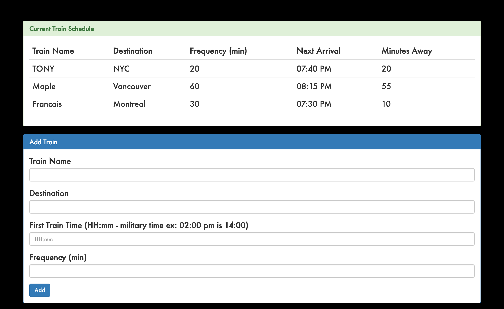

#Train Schedule

[Train Schedule link](https://secret-chamber-80015.herokuapp.com/
)

###Firebase is a great tool for developers to use. It can be used to store data, verify users, and implement access rules. In this app, I used Firebase to store train schedule details such as the name of the train, destination, first train time (military time), and the frequency. From those details, the next train arrival can be calculated. This particular version updates every minutes without reloading the page.

###This app was built using HTML, CSS, Bootstrap, jQuery, Firebase, and Moment.js.

###Below is an image of the Train Schedule app.
